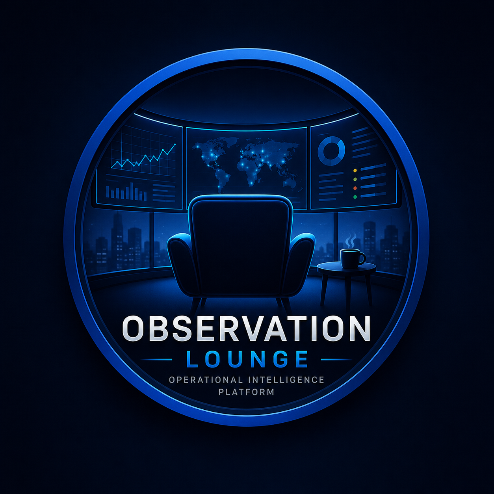
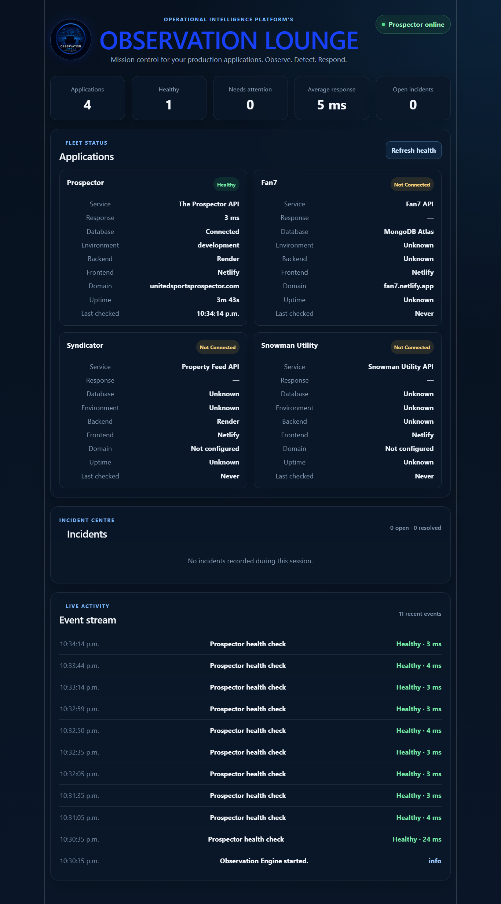

# Observation Lounge

---

> **Operational intelligence platform for monitoring production applications, system health, performance, incidents, and live operational events.**

---

## Overview

Observation Lounge is a centralized operational intelligence platform for monitoring a fleet of production applications from one place.

It combines a React dashboard, a reusable event-driven Observation Engine, an Express API, and a MongoDB-backed Application Registry.

The platform performs recurring application health checks, normalizes different backend response formats, measures response latency, tracks database connectivity, publishes operational events, detects incidents, and records recoveries.

The current production fleet includes:

- The Prospector
- Apartments.com Syndicator

The architecture is designed to support additional applications and services including:

- Fan7
- Snowman Utility
- Stripe
- MongoDB Atlas
- Render
- Netlify
- GitHub Actions
- Background jobs
- Deployment pipelines
- Domains and SSL certificates

---

## Production Services

### Frontend

https://the-observation-lounge.netlify.app
Observation Lounge API
https://observation-lounge-api.onrender.com
API Health
GET https://observation-lounge-api.onrender.com/api/health
Application Registry
GET https://observation-lounge-api.onrender.com/api/applications
Key Features
Event-driven Observation Engine
MongoDB-backed Application Registry
Express application-management API
Production application health monitoring
Five-minute automatic polling
Manual health refresh
Response-time measurement
Database connectivity reporting
Automatic incident detection
Automatic incident resolution
Live operational event stream
Session performance metrics
Application-specific health endpoint support
Health-response normalization
Modular processor architecture
Render and Netlify deployment
Persistent application configuration
Current Production Fleet
Application	Connection	Health endpoint	Status
The Prospector	Connected	/api/health	Healthy
Apartments.com Syndicator	Connected	/api/observation	Healthy

Additional applications can be added through the Observation Lounge Application API without changing frontend code.

MongoDB is now the permanent source of truth for the monitored fleet.

Live Application Monitoring

Observation Lounge performs an initial fleet check when the dashboard loads and continues polling connected applications every five minutes.

The dashboard displays:

Current application status
API response time
Database connectivity
Environment
Backend provider
Frontend provider
Domain
Server uptime
Last checked time
Current incidents
Live operational events

A manual Refresh health control is also available for immediate checks.

Health Normalization

Applications do not need to return identical JSON structures.

Observation Lounge normalizes several supported formats into the common states:

Healthy
Degraded
Offline

Supported response examples include:

{
  "ok": true
}
{
  "success": true,
  "status": "healthy"
}
{
  "status": {
    "state": "healthy"
  }
}
{
  "health": {
    "status": "healthy"
  }
}

Database responses are also normalized from formats such as:

{
  "database": "Connected"
}

and:

{
  "database": {
    "status": "Connected"
  }
}
System Architecture
Production Applications
         │
         ├── The Prospector
         ├── Apartments.com Syndicator
         └── Future Applications
         │
         ▼
Application Health Service
         │
         ▼
Observation Engine
         │
         ▼
Event Bus
         │
         ├── History Processor
         ├── Incident Processor
         ├── Metrics Processor
         └── Future Alert Processor
         │
         ▼
React Dashboard

The platform also includes a persistent backend registry:

React Dashboard
       │
       ▼
Observation Lounge API
       │
       ▼
MongoDB Application Registry
       │
       ├── Application configuration
       ├── Health endpoints
       ├── Connection status
       ├── Polling configuration
       └── Latest operational state
Application Registry

The Application Registry is stored in MongoDB and accessed through the Observation Lounge API.

The frontend no longer contains hardcoded application templates or startup registration logic.

Each application record can contain:

MongoDB ID
Application name
Display name
Service name
Description
Base URL
Health endpoint
Generated health URL
Connection status
Health status
Environment
Enabled status
Polling interval
Owner
Database status
Last response time
Last checked timestamp
Created timestamp
Updated timestamp

Example record:

{
  "name": "prospector",
  "displayName": "The Prospector",
  "service": "The Prospector API",
  "baseUrl": "https://the-prospector.onrender.com",
  "healthEndpoint": "/api/health",
  "environment": "production",
  "connectionStatus": "Connected",
  "healthStatus": "Healthy",
  "enabled": true,
  "pollInterval": 300000,
  "databaseStatus": "Connected"
}
Application API
List applications
GET /api/applications
Get one application
GET /api/applications/:id
Register an application
POST /api/applications
Update an application
PATCH /api/applications/:id
Delete an application
DELETE /api/applications/:id
Run a live health check
POST /api/applications/:id/check

The health-check route:

Loads the application from MongoDB.
Builds its health URL.
Requests the live endpoint.
Measures response time.
Normalizes the response.
Updates the MongoDB record.
Returns the latest operational result.
Observation Engine

The Observation Engine coordinates operational activity across the platform.

Responsibilities
Starting and stopping the engine
Registering processors
Publishing normalized events
Routing events through the Event Bus
Protecting the platform from processor failures
Reporting engine statistics
Maintaining one shared browser engine instance

The engine contains no React dashboard logic.

Event Bus

The Event Bus is the central communication layer.

Applications and services publish events without needing to know which processors will receive them.

Publisher
   │
   ▼
Event Bus
   ├── History Processor
   ├── Incident Processor
   ├── Metrics Processor
   └── Future Alert Processor

This keeps the platform modular, loosely coupled, and extensible.

Automatic Incident Detection

Observation Lounge watches application-health transitions and responds automatically.

Incident opening

An incident is opened when a monitored application changes from:

Healthy → Offline

or:

Healthy → Degraded
Incident resolution

An open incident is resolved automatically when the application recovers:

Offline → Healthy

or:

Degraded → Healthy

The first complete outage and recovery cycle has been successfully tested.

Operational Event Stream

Every event published through the Observation Engine is recorded in the live event stream.

Current events
Observation Engine started
Prospector health check
Syndicator health check
Application incident opened
Application incident resolved
Planned events
Stripe payment failed
Deployment completed
MongoDB latency increased
Customer synchronization failed
Background job completed
SSL certificate renewed
Domain expiration warning
Application configuration changed
Session Metrics

The Metrics Processor currently tracks:

Total health checks
Healthy checks
Degraded checks
Offline checks
Average response time
Fastest response time
Slowest response time
Latest response time
Per-application performance metrics
Project Structure
observation-lounge/
├── observation-lounge-api/
│   ├── src/
│   │   ├── controllers/
│   │   │   └── applicationController.js
│   │   │
│   │   ├── models/
│   │   │   └── Application.js
│   │   │
│   │   ├── routes/
│   │   │   ├── applicationRoutes.js
│   │   │   └── healthRoutes.js
│   │   │
│   │   ├── app.js
│   │   ├── connectDatabase.js
│   │   └── server.js
│   │
│   └── package.json
│
├── src/
│   ├── engine/
│   │   ├── core/
│   │   │   ├── eventBus.js
│   │   │   └── observationEngine.js
│   │   │
│   │   ├── processors/
│   │   │   ├── historyProcessor.js
│   │   │   ├── incidentProcessor.js
│   │   │   └── metricsProcessor.js
│   │   │
│   │   ├── registry/
│   │   │   └── applicationRegistry.js
│   │   │
│   │   ├── services/
│   │   │   └── eventFactory.js
│   │   │
│   │   ├── types/
│   │   │   └── eventTypes.js
│   │   │
│   │   └── index.js
│   │
│   ├── services/
│   │   └── healthService.js
│   │
│   ├── App.jsx
│   ├── App.css
│   └── main.jsx
│
├── pages/
│   └── AppConnectionsPage.jsx
│
├── public/
│   ├── observation-lounge.png
│   └── screenshot.png
│
└── package.json
Technology
Frontend
React 19
Vite 8
JavaScript
CSS
React Hooks
Browser Fetch API
Event-driven architecture
Backend
Node.js
Express
MongoDB Atlas
Mongoose
CORS
Helmet
Morgan
dotenv
Deployment
Netlify frontend
Render API
MongoDB Atlas database
Local Development
Frontend

Install dependencies:

npm install

Create:

.env.local

Add:

VITE_OBSERVATION_LOUNGE_API_URL=http://localhost:5055

Start the frontend:

npm run dev

Observation Lounge will normally be available at:

http://localhost:5173

or:

http://localhost:5174
Backend

Move into the API directory:

cd observation-lounge-api

Install dependencies:

npm install

Create:

.env.local

Add:

PORT=5055
NODE_ENV=development
MONGODB_URI=your_mongodb_connection_string

Start the backend:

npm run dev

The API will be available at:

http://localhost:5055

Test:

http://localhost:5055/api/health
http://localhost:5055/api/applications
Production Environment
Render API environment variables
NODE_ENV=production
MONGODB_URI=your_production_mongodb_connection_string

Render provides the production PORT automatically.

Netlify frontend environment variable
VITE_OBSERVATION_LOUNGE_API_URL=https://observation-lounge-api.onrender.com

Vite environment variables are embedded during the build, so a new Netlify deployment is required after changing them.

Polling

Connected applications are checked:

Immediately when the dashboard starts

and then:

Every 5 minutes

The interval is configured in src/App.jsx:

window.setInterval(() => {
  void checkAllApplications();
}, 5 * 60 * 1000);

A React ref prevents the initial health check from firing more than once during startup.

Example Health Responses
The Prospector
{
  "ok": true,
  "service": "The Prospector API",
  "environment": "production",
  "database": "Connected",
  "uptimeSeconds": 57,
  "timestamp": "2026-07-27T04:10:31.403Z"
}
Apartments.com Syndicator
{
  "observationVersion": 1,
  "application": {
    "id": "syndicator",
    "name": "Wall Syndicator",
    "type": "syndication"
  },
  "status": {
    "state": "healthy",
    "message": "Feed generation service operational"
  },
  "database": {
    "status": "Connected"
  },
  "metrics": {
    "properties": 19,
    "floorplans": 241,
    "units": 1644
  }
}
Event Structure

All operational events are normalized before entering the engine.

{
  id: "event-id",
  type: "health.check",
  application: "The Prospector",
  source: "api",
  severity: "info",
  message: "The Prospector health check: Healthy",
  payload: {
    status: "Healthy",
    responseTime: 220,
    database: "Connected"
  },
  timestamp: new Date(),
  createdAt: new Date()
}
Event Types
Categories
health.*
incident.*
performance.*
billing.*
job.*
deployment.*
security.*
system.*
Examples
health.check
health.offline
health.recovered
incident.opened
incident.resolved
billing.payment_failed
job.completed
deployment.failed
security.login_failed
system.error
Roadmap
Phase 1: Observation Core
 Application Registry
 Event Factory
 Event Bus
 Observation Engine
 Health monitoring
 Event history
 Performance metrics
 Incident detection
 Automatic incident resolution
Phase 2: Persistent Platform Foundation
 Express backend
 MongoDB connection
 Application model
 Application CRUD API
 Mongo-backed registry
 Production Render deployment
 Production Netlify integration
 Live backend health checks
 Prospector integration
 Syndicator integration
 Persistent health-event history
 Persistent incident history
 Persistent metrics snapshots
 Application ownership and threshold editing
Phase 3: Operational Intelligence
 Historical uptime reports
 Response-time charts
 Alert rules
 Email notifications
 Deployment tracking
 Background job monitoring
 Stripe billing events
 MongoDB monitoring
 SSL and domain monitoring
 Automated drop-off alerts
 Usage-event tracking
 Cohort analysis
Phase 4: Multi-Application Operations
 Fan7 integration
 Snowman Utility integration
 Syndicator integration
 Unified fleet health
 Per-application detail views
 Asset Registry
 Infrastructure monitoring
 Environment separation
 Authentication and user access
Phase 5: AI Operations
 Incident summaries
 Root-cause suggestions
 Anomaly detection
 Performance trend analysis
 Failure prediction
 Automated postmortems
 Operational recommendations
Product Direction

Observation Lounge is evolving beyond a health dashboard into a reusable operational intelligence platform.

It is designed to monitor:

Applications
APIs
Databases
Payment systems
Deployments
Background jobs
Domains
SSL certificates
Cloud infrastructure
External integrations
User activity
Product adoption
Feature drop-off

The dashboard is one consumer of the Observation Engine.

Future consumers may include:

Command-line tools
Mobile dashboards
Slack alerts
Email reports
Public status pages
AI operations assistants
External APIs
Current Status

Observation Lounge currently supports:

Production Netlify frontend
Production Render backend
MongoDB Atlas registry
Mongo-backed application configuration
The Prospector health monitoring
Apartments.com Syndicator monitoring
Automatic five-minute polling
Manual health refresh
Health-response normalization
Database-status normalization
Automatic outage detection
Automatic incident creation
Automatic recovery detection
Automatic incident resolution
Live event history
Session performance metrics
Unified fleet dashboard

The first complete outage and recovery cycle has been successfully tested.

The Observation Lounge backend, MongoDB registry, Prospector integration, and Syndicator integration are now working in production.

License

MIT